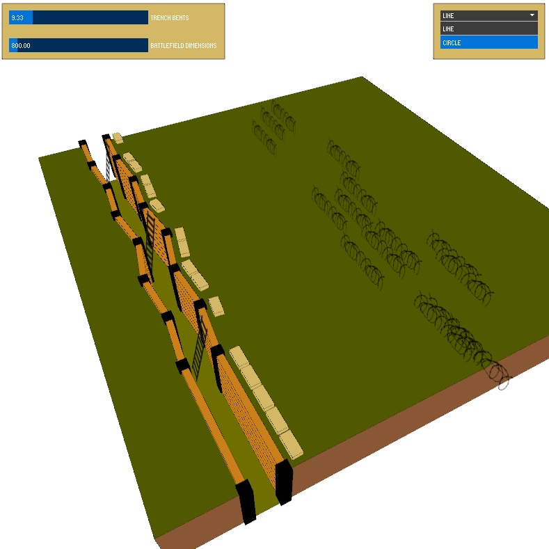
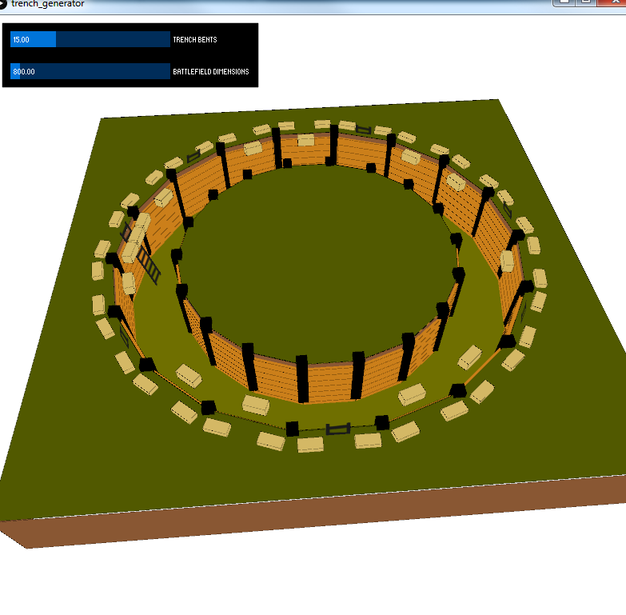
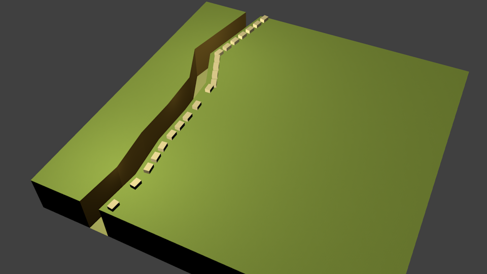

<h1>WORLD WAR ONE - TRENCH GENERATOR</h1>
 
Generate random trenches with live parameter tweaking and choose from several trench shapes.  
Once you are satisfied,you can export the trench to XML. 
A python script to set up the scene from the exported XML inside Blender is available. 
 
It is using <a href="http://www.sojamo.de/libraries/controlP5/">controlP5</a> for UI Elements and <a href="http://mrfeinberg.com/peasycam/">peasycam</a> as camera script. 
 

 

This is the (not yet finished) circle trench mode.  

 

This is how the scene looks in a sample setup in Blender after importing it from the generated XML trench file.

 

Play fair. Have fun.
