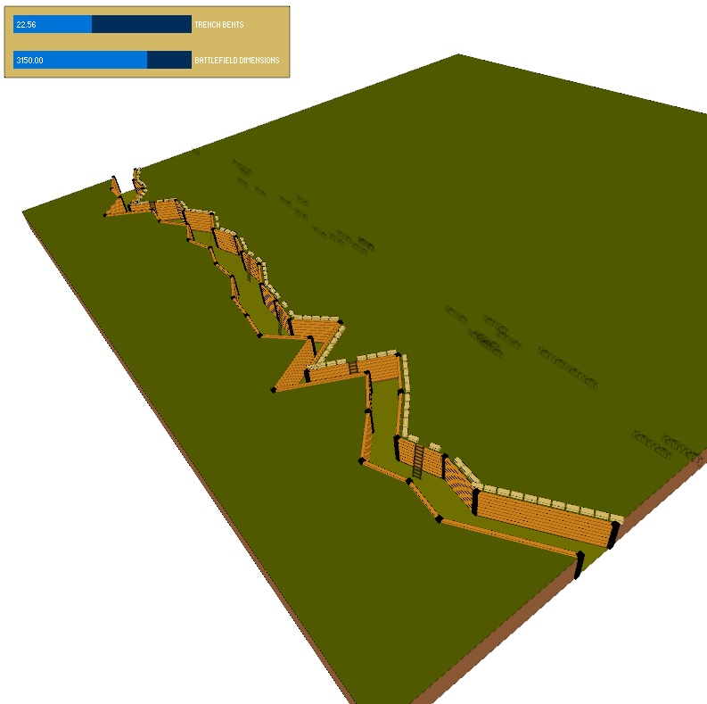
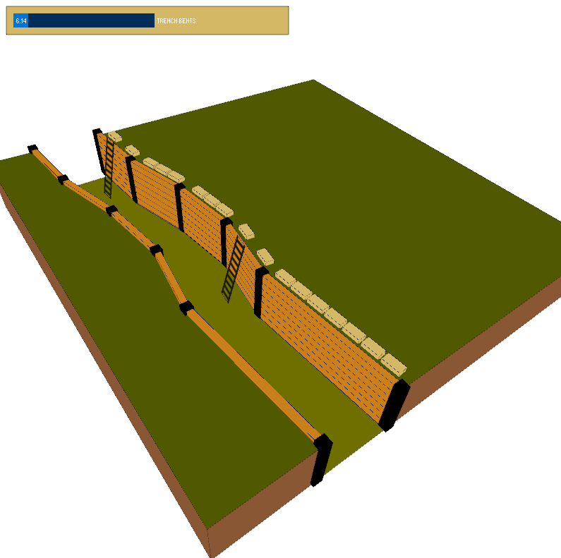

This is a simple project in Processing 3.x to generate a trench like in World War 1.

Right now you can change the number of bents in the trench line.  
 
Added some ladders with a transparent texture. 
Sandbags are now added. When theres a ladder, the sandbag is not placed 
The dimension of the battlefield can now be changed, making really long trenches possible 

It is using <a href="http://www.sojamo.de/libraries/controlP5/">controlP5</a> for UI Elements and <a href="http://mrfeinberg.com/peasycam/">peasycam</a> as camera script. 

 

 

It's aim is to generate all the vertices and objects in a clear format so that other scripts can use them to quickly generate the trench in their domain.

No license, all public domain.
